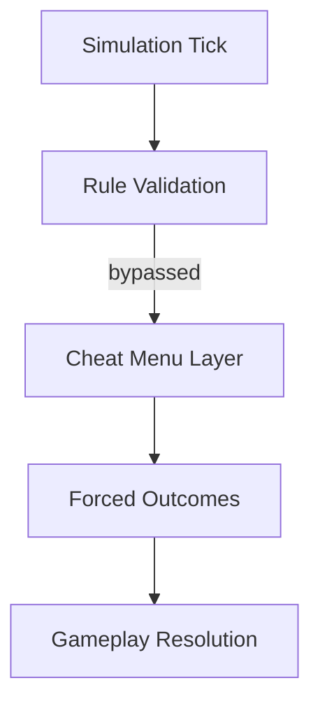

## Overview

Positioned as a rule-intervention interface, **Youtubers Life 3 Cheat Menu** connects to the active simulation loop of Youtubers Life 3 and alters how the game decides what is allowed to happen. Instead of tuning values gradually, the menu focuses on bypassing or enforcing conditions tied to success, failure, and limitation systems. These include exhaustion penalties, production requirements, social consequences, and monetary constraints. All changes are applied instantly, remain session-scoped, and disappear once the menu is disengaged.

---

## Rule Bypass: Content Creation

* Recording and editing requirements disabled
* Upload cooldown conditions ignored
* Mandatory preparation checks suppressed

**Simulation effect:**
Content actions resolve as valid regardless of readiness, resources, or time investment.

---

## Time Cost Suppression Layer

* Activity duration checks removed
* Day progression halted or accelerated
* Fatigue accumulation disabled

**System behavior:**
Actions no longer consume meaningful in-game time unless explicitly allowed.

---

## Audience Logic Manipulation

* Subscriber gain rules overridden
* View calculation constraints bypassed
* Trend penalties neutralized

**Simulation effect:**
Audience metrics update independently of algorithmic performance rules.

---

## Economy Constraint Removal

* Spending validation ignored
* Income generation forced
* Sponsorship payout rules overridden

**System behavior:**
Financial transactions succeed even when prerequisite conditions are unmet.

---

## Social Outcome Forcing

* Event success conditions disabled
* Relationship decay prevented
* Reputation loss blocked

**Simulation effect:**
Social interactions resolve positively regardless of preparation or timing.

---

## Career Gate Neutralization

* Milestone checks bypassed
* Feature locks removed
* Location access forced

**System behavior:**
Progression barriers function as toggles rather than earned achievements.

---

## Penalty and Failure State Control

* Burnout and stress fail-states disabled
* Negative feedback loops suppressed
* Forced recovery states

**Simulation effect:**
Loss conditions are prevented from triggering while cheats remain active.

---

## Cheat Menu Control Surface

* Category-separated toggle groups
* Immediate rule revalidation on disable
* Clean restoration of default logic

**System behavior:**
Once toggles are off, original rule evaluation resumes without residual effects.

---

---

## FAQ

**Does the cheat menu change progression permanently?**
No, progression rules return once the menu is disabled.

**Are time costs completely removed?**
They can be suppressed or selectively re-enabled per action type.

**Can negative social events still occur?**
Only if the corresponding rule bypass is disabled.

**Is money generation unlimited?**
Income rules can be forced, but values are not written to saves.

**Do unlocks persist after restart?**
No, all forced access is session-only.

**Can individual rule groups be toggled separately?**
Yes, each constraint category is independently controlled.

---

## Feature Summary

* Content creation rule bypass
* Time and fatigue cost suppression
* Audience metric constraint removal
* Economy and spending validation override
* Social interaction outcome forcing
* Career and feature gate neutralization
* Failure-state prevention systems
* Session-bound cheat menu with full logic restore

---
